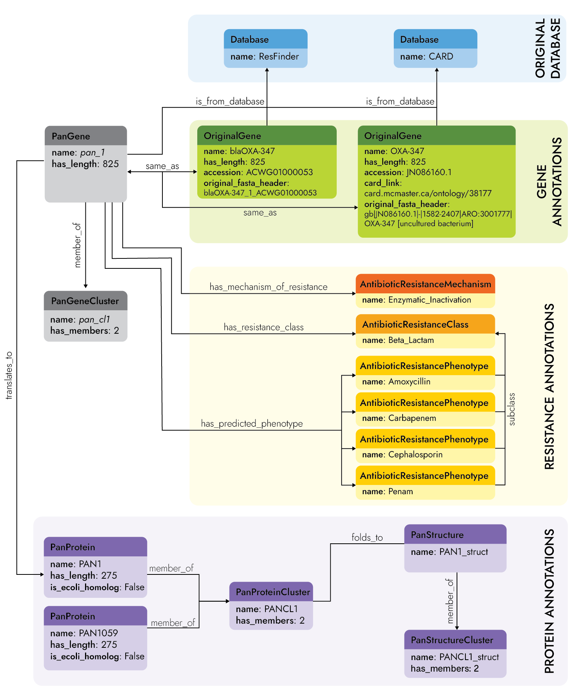

# PanRes2 Ontology
This GitHub repository contains the "ontologisation" of the annotations for the genes and proteins part of the PanRes collection. 

**The OWL file can be found in the [ontology](/ontology/) folder: [panres_v2.owl](/ontology/panres_v2.owl)**

## Working With the Ontology
There are a few examples of querying the PanRes ontology in the [notebooks folder](/notebooks), specifically the Jupyter Notebook [Queries.ipynb](/notebooks/Queries.ipynb).

## Building The Ontology From Scratch
In order to build the ontology with the genes included in the first version of PanRes, make sure to have the data files downloaded as well (see [data/](/data)).

### Requirements
To built the ontology from scratch, the following libaries are required:
```
owlready2==0.44
loguru==0.7.3
pandas==1.5.3
numpy==1.24.3

```

### Execute
then run the script:
```
python code/PanResOntology.py
```
which will produce the OWL file [panres_v2.owl](/ontology/panres_v2.owl).

## PanRes API Reference
The module in [model.py](/code/model.py) defines the ontology schema for the PanRes database using `owlready2`. It includes classes for various types of resistance genes, databases, and resistance types, as well as functional properties to describe relationships and attributes.

Extended documentation on the classes and properties are described in the [model.md](docs/model.md) file.

This figure shows the information structured in the ontology for the `pan_1` gene.

